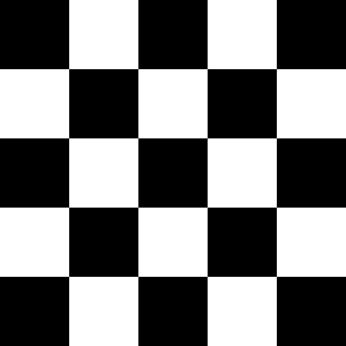
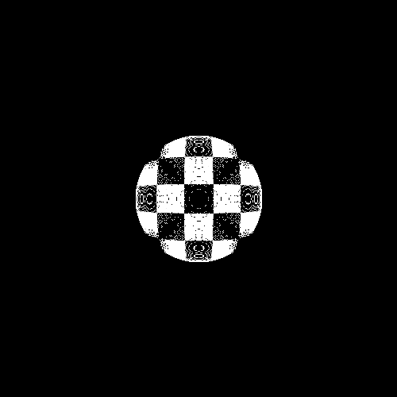

<div style="display: flex; justify-content: center; align-items: center; gap: 20px; margin-bottom: 60px;">
  
  
</div>

# Kugelblick – Inverse Sphere Distortion

Kugelblick is a small toolset for distorting graphics in such a way that they appear undistorted when viewed through a transparent glass sphere.

> [!Note]
> “Kugelblick” is a German compound word meaning “sphere gaze” or “globe view”. It captures the idea of looking through a transparent glass sphere.

**Typical use case**: An engraving or print on a flat surface should appear correctly when viewed through a sphere placed on top of it.

This project includes two scripts:

- `distort.py` – generates the pre-distorted (inverse) image.
- `calibration.py` – estimates refractive index and sphere distance from a calibration photo (checkerboard pattern).

> [!Note]
> This project was fully written with OpenAI `codex` (using the `o3` model).

## Installation

**Requirements**: Python ≥ 3.9 and a working `pip` installation.

```bash
# optional but recommended:
python3 -m venv .venv
source .venv/bin/activate  # Windows: .venv\Scripts\activate

pip install -r requirements.txt
```

`requirements.txt` contains:

```
numpy
opencv-python
Pillow
scipy  # only needed for calibration.py
```

If you’re only using `distort.py`, you can omit `scipy`.

## 1. Pre-distort an Image – `distort.py`

```bash
python distort.py INPUT.png OUTPUT.png \
    --sphere_diameter_mm 10.0 \
    --distance_mm 0.0 \
    --refractive_index 1.46 \
    --dpi 300
```

**Parameters** (all have sensible defaults):

| Option                 | Default | Meaning                                            |
| ---------------------- | ------- | -------------------------------------------------- |
| `INPUT.png`            | –       | Source image (PNG, supports RGBA)                  |
| `OUTPUT.png`           | –       | Output image (will be created)                     |
| `--sphere_diameter_mm` | `10.0`  | Diameter of the sphere in mm                       |
| `--distance_mm`        | `0.0`   | Distance from sphere bottom to image surface in mm |
| `--refractive_index`   | `1.46`  | Material refractive index                          |
| `--dpi`                | `300`   | Resolution to convert mm → px                      |

Everything outside the sphere radius remains unchanged — so you can place text or graphics around the sphere.

## 2. Determine Parameters – calibration.py

If the refractive index or distance are not precisely known, you can estimate them from a photo of a checkerboard pattern.

```bash
# For a 5x5 squares checkerboard with 4x4 inner corners:
python calibration.py PHOTO.png \
    --pattern_cols 4 --pattern_rows 4 \
    --square_size_mm 5.0 \
    --sphere_diameter_mm 10.0
```

Sample output:

```
Optimised parameters:
  refractive_index: 1.456211
  distance_mm: 0.327845
  scale_px_per_mm: 23.989102
  rms_px: 0.42
```

You can then use these values in `distort.py.

### Calibration Photo – Tips

1. Print a checkerboard (e.g. 8 × 8 squares, inner corners = 7 × 7) or engrave it onto the surface.
2. Center the sphere on the pattern.
3. Take a photo directly from above (tripod, camera aligned parallel).

## FAQ

**Other patterns besides checkerboard?** – Not yet, as OpenCV’s corner detection is used.

**Artifacts outside the sphere?** – Make sure there’s enough padding in the original or increase the resolution (--dpi).

Enjoy your sphere viewing!
